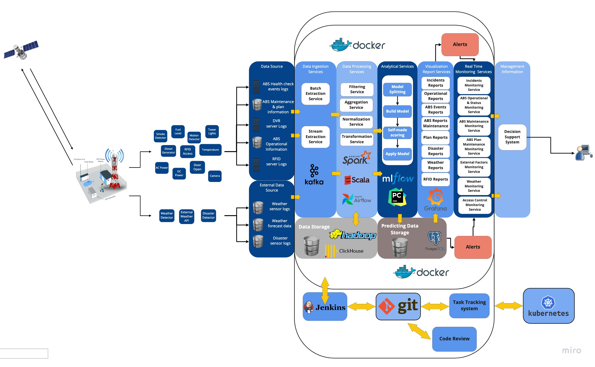
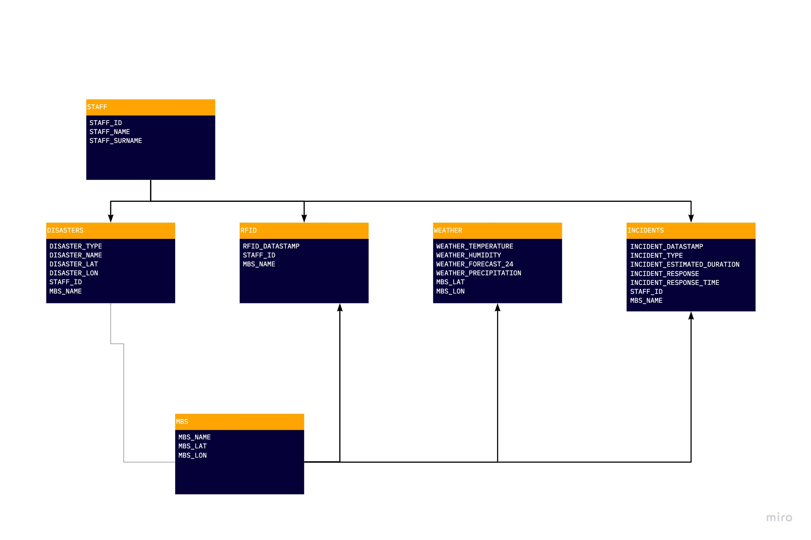

# MTS_Kata
- [MTS_Kata](#mts_kata)
  - [Team](#team)
  - [Overview](#overview)
  - [Business Case and Goals](#business-case-and-goals)
  - [Description of the Information System Structure and system parts](#description-of-the-information-system-structure-and-system-parts)
  - [List of significant architectural properties](#list-of-significant-architectural-properties)
  - [List of major architectural decisions and their rationale](#list-of-major-architectural-decisions-and-their-rationale)
  - [Data model](#data-model)

## Team

**Team Members** 

Kirill Shcheblanov, 
Vyacheslav Panteleev,
Aleksandra Mikhailova,
Pavlyuchenko Konstantin,
Pavel Kuchin,
El Darawany Ahmed.

**Who we are:** We are second year students, studying in HSE master's program "Big Data Systems".

## Overview

It is necessary to develop an information system architecture that allows to carry out:
 - MBS status monitoring
 - monitoring of its operating conditions
 - monitoring of external factors affecting the MBS
 - monitoring planned and actual maintenance
 - predict the need for maintenance
 - schedule maintenance and accumulate information about its implementation

## Business Case and Goals

The overall goal of mobile base stations is to serve and provide mobile internet.

Users: up to 6 thousands subscribers of Telco operator and up to 1 thousand subscribers for using mobile internet.

## Description of the Information System Structure and system parts

## List of significant architectural properties

1) Visibility
- monitoring of interaction between components can improve scalability, reliability and security
- improving scalability through layered services (all layer interactions are logged)
- improving reliability through monitoring logs and workload from virtual machines with services 
- improving security through monitoring interactions and accesses

2) Scalability
- the amount of ABS can be expanded, which means it is important that the system is scalable
- layered services, easy to deploy and scale components (Docker, Jenkins, Kubernetes)
- the load on components is distributed (Kafka)

3) Reliability
- it is very important to maintain ABS on time, system downtime and untimely maintenance are associated with high costs
- monitornig of workload (Grafana)
- healthcheck of the system (Grafana, Docker, Jenkins)
- redundancy (Virtual Machine backup service)

4) Modifiability
- it is important to update the system without stopping and restarting the entire system, system downtime and untimely maintenance are associated with high costs
- automated component updates without stopping and restarting the entire system (Docker, Jenkins, Kubernetes)
- automatic testing (Jenkins)

5) Performance
- performance is important for big data processing and preventing the generation of large data queues
- caching (Apache Spark)

## List of major architectural decisions and their rationale

1) The alert system:
- The alert system is set up above the operational database to warn about events that have already taken place (electricity consumption has exceeded the weekly rate)
- Alert system set up over predictive data warehouse to alert potential events (less than 12 hours of battery life at current power consumption)
- Alert data and final reports are transferred to monitoring and visualization tools for further interaction with the user when making decisions
2) On the basis of analytical services and training pipelines, models are created and predict the result. The result is stored in a separate storage for quick access to the results of calculations. All collected data (clean sensor data and model prediction results) is used to create human-readable and business-based reports. In fact, reports are a separate specialized slice of data necessary to solve a specific issue.
3) All received data is saved, however, cleaning and pre-processing is necessary for further work. Depending on the specifics of the data, there can be either simple filtering, or the calculation of basic indicators, and even the use of pre-trained models to identify problematic data that should not be allowed into further analysis.
4) We used Kafka to process incoming sensor values in real time. This allows you to process many sensors at once and have a minimum delay in receiving signals, which is important for predicting anomalies.
5) For a more accurate prediction of weather and disasters, it is necessary to have a geographically distributed network of sensors, for this reason we have considered the data from them to an external source.

## Data model
